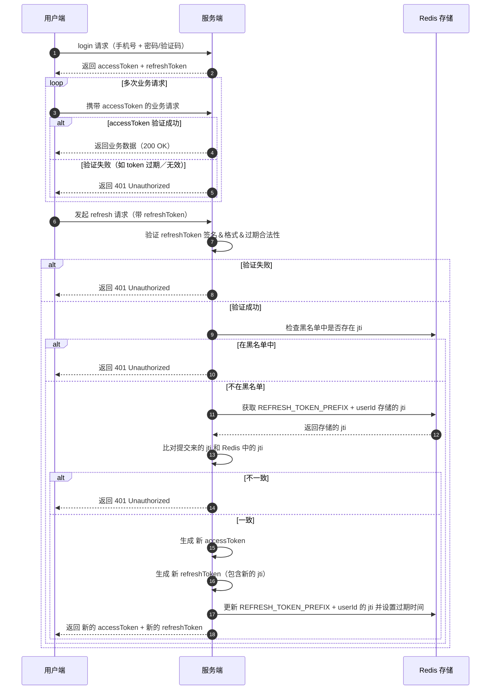
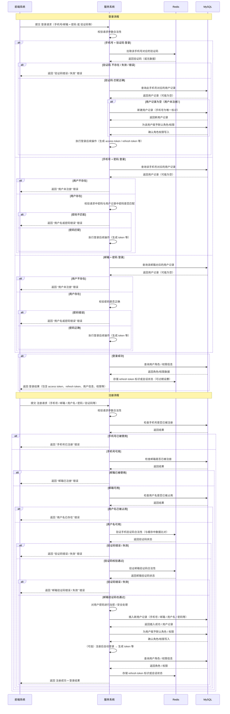

**毕设：快递驿站系统（后端部分）**


# 基本思路

选题是复刻一个菜鸟驿站，但只能用自己的手机和电脑，所以一些东西可能得换种方式实现或模拟，例如扫描枪、驿站的机器、取件码标签打印等 ；

用户的主要使用流程是：在手机小程序上可以查看快递的预计送达时间（数据可能需要Mock），送达代收点后，可以看到取件码（例如3-2-1004），到了代收点，可以手机展示个人身份码条形码，对着驿站里的机器的摄像头（由于条件限制，用前端界面+电脑摄像头模拟）放入身份码和快递上的条形码，就可以出库； 

驿站工作人员的主要使用流程是：驿站人员的可以通过小程序扫描包裹上的快递单条形码，系统生成取件码（如3-2-1004），系统打印取件码标签，驿站人员将标签贴在包裹上并将包裹放在对应的货架上，系统通知用户包裹已入库； 

附加功能（暂不实现）：寄包裹（上门取件），上门送包裹等


# 服务拆分

| 服务 / 模块      | 职责                                             |
| ---------------- | ------------------------------------------------ |
| Common 模块      | 公共模块：包括异常、枚举、常量类、切面、拦截器等 |
| Feign 模块       | 远程调用：包含所需的VO和DTO及调用接口            |
| **Gateway 服务** | 网关                                             |
| **Auth 服务**    | 权限校验，token生成，token校验，登录注册         |
| **User 服务**    | 地址管理，身份码生成，用户信息管理               |
| **Parcel 服务**  | 包裹管理                                         |
| **Store 服务**   | 门店信息、货架信息管理                           |


# 项目部署

项目中所有的组件都通过 docker compose 部署，yaml文件在项目中准备好：`./resource/docker-compose/e-dove.yaml`；


## docker环境

>  实际上windows版docker也可以；如果用linux虚拟机，则wsl和vmware都可以；

### linux环境（可选）

组件部署需要准备docker环境，这里以`wsl`为例子；

在windows下安装wsl，默认为ubuntu系统：

```
wsl --install
```

### 安装docker

>  在wsl中安装docker

方式一：

​	按照 [wsl官网](https://learn.microsoft.com/zh-cn/windows/wsl/tutorials/wsl-containers)上的说明，安装Windows 的 Docker Desktop，并集成至wsl；

方式二：

​	按照[docker官网](https://docs.docker.com/desktop/setup/install/linux/ubuntu/)上的说明，直接在wsl中安装docker；

### 配置docker镜像源（可选）

参考 [DockerHub 国内加速镜像列表](https://github.com/dongyubin/DockerHub) 配置即可；

**tip**：由于镜像源不稳定且可能被下架，可以不配置镜像源，使用**代理**：

1. 确保linux虚拟机的网络模式是**桥接模式**（wsl默认）
2. 开启代理，启用**服务模式**，还需要开启**TUN模式**；


## 启动组件

将`e-dove.yaml`文件放入linux的`home`目录；

启动命令：

```
docker compose -f e-dove.yaml -p e-dove up -d
```

关闭命令：

```
docker compose -f e-dove.yaml -p e-dove down
```


## 配置组件

### 创建nacos命名空间

组件启动后，在本机访问 `linux地址:8848/nacos` 进入nacos控台，首次进入需要设置**初始密码**，设置为`nacos`；

> 即用户名`nacos`，密码`nacos`；如果不这样设置，需要不少地方的配置；

在"命名空间"栏创建命名空间，命名空间ID设置为`e-dove-1014`;


### Redis配置

redis的**配置**已准备在项目中：`./resource/redis/redis.conf`；

将文件放入linux的`home`目录，并将文件移动到挂载配置文件的位置；

```
sudo mv ./redis.conf ./e-dove/redis/conf/redis.conf
```


### Seata配置

seata相关的**配置**已准备在项目中：`./resource/seata/applicayion.yml`

添加前，需要修改配置中的内容：

```yml
services:
  seata-server:
	...
    environment:
      - SEATA_IP=172.28.80.78  # 改成linux的ip地址，可用`ip a`命令查看
    ...
```

将文件放入linux的`home`目录，并将文件移动到挂载配置文件的位置；

```
sudo mv application.yml ./e-dove/seata/conf/
```

除此之外，seata镜像本身不包含**jdbc**，需要自己准备，已准备在项目中：`./resource/seata/mysql-connector-j-8.4.0.jar`

将文件放入linux的`home`目录，并将文件移动到挂载配置文件的位置；

```
sudo mv mysql-connector-j-8.4.0.jar ./e-dove/seata/jdbc/
```


### 初始化MySQL

docker compose 启动完成后：

1. 使用 `e-dove.yaml` 中的 `root` 用户登录MySQL；
2. 执行 `./resource/mysql` 目录下的所有sql语句；


## 环境变量

项目中一些地方需要使用环境变量做配置，需要配置**项目运行的系统**的环境变量（可以是windows，也可以是打包后运行在的linux或docker）

> 用引用环境变量的方式，就不用改那么多地方了；但是有些地方还是必须要修改，比如seata的配置等，没有办法；

### docker所在地址

使用：

```yaml
spring:
  data:
    redis:
      host: ${E_DOVE_DOCKER_IP_ADDR}
```

查看linux虚拟机的IP地址：

```
ip a
```

找到**eth0**的IP地址：

```
criel@CrielLaptop:~$ ip a
1: lo: ... # 省略
2: eth0: <BROADCAST,MULTICAST,UP,LOWER_UP> mtu 1500 qdisc mq state UP group default qlen 1000
    link/ether 00:15:5d:29:21:16 brd ff:ff:ff:ff:ff:ff
    inet 172.28.80.78/20 brd 172.28.95.255 scope global eth0  # <---- IP地址为此处的172.28.80.78
       valid_lft forever preferred_lft forever
    inet6 fe80::215:5dff:fe29:2116/64 scope link
       valid_lft forever preferred_lft forever
3: ... # 省略
```

将IP地址保存在环境变量中：

```
E_DOVE_DOCKER_IP_ADDR = docker所在的主机的地址 （如果部署在本机，则可以配置成127.0.0.1）
```


# 系统设计

## 双token身份校验

jwt + refresh token + 黑名单

时序图：




## 服务间认证

OAuth 2.0


## 用户权限控制

RBAC


## 登录/注册

**注册**：必须使用手机号 + 验证码，可选择设置邮箱和密码；

**登录**：提供3种登录方式：

- 手机号 + 验证码（若用户不存在，则会自动注册）
- 手机号 + 密码
- 邮箱 + 密码

其他：

- 前端还需要人机验证码；
- 密码的处理采用：`Argon2id`密码哈希算法（在抗 GPU／ASIC 攻击方面比`bcrypt`更强）

> tip：`Argon /ˈɑːrɡən/ `, `bcrypt /biːˈkrɪpt/`




## 日志框架

选择`logback`，Spring自带


## 身份码

菜鸟驿站生成的身份码例如：`CS80781256880238623F`；但是我没有找到生成这种码的方法😿

身份码需要携带**2个信息**：

- 用户身份信息：
  - 如果用用户ID，雪花算法生成的ID就占十进制的**19位**
  - 如果用电话号码，也需要占**11位**
- 身份码生成时间信息（时效性，判断是否过期）
  - 如果直接用时间戳，则会占十进制的**19位**
  - 如果精确到分钟，则需要：`19位的long类型 / (60 * 1000)`，大约**8位**；
- 此外，还需要对生成的码**加密/签名**，否则容易轻易伪造身份码；

最后，采取了这样的策略：**手机号 + 精确到分钟的时间信息 + HMAC-SHA256密钥加密算法**；

具体过程如下：

1. 首先获取手机号和时间，并拼接到一起，例如`13888888888` + `29324370` = `1388888888829324370`，记为`data`
2. 准备一个密钥`key`，做加密运算（具体过程省略），得到`签名sipHash = sipHash24(data, key)`；其中，`sipHash`是一个**字节数组**`byte[]`，长度为**8**；
3. 将`sipHash`与`data`拼接，得到例如`data + sipHash = code = 1388888888829324375�g��S`，也就是明文部分 + 签名部分；（注意代码中`code`是一个**字节数组**`byte[]`，所以直接以字符串输出可能会乱码）
4. 用**Base36**对`code`编码，得到最终的身份码，例如`barcode = 28mx314bxfmvdozhzpmvusr7ntpibjh4ifhb3ff`；
5. 生成条形码：将`barcode`转为**全大写**：`28MX314BXFMVDOZHZPMVUSR7NTPIBJH4IFHB3FF`，并生成`Code128`条形码图片，即是用户的身份码；
6. 将条形码图片用**Base64**编码，将编码后的Base64字符串返回给前端；

签名算法对比：由于需要需要缩短条形码长度，如果使用长度较长的算法，则需要截取，浪费了计算性能，所以选取了**SipHash**，其性能是HMAC-SHA的**10倍**

| 方案        | 输出长度 | 安全性 | 性能 | 适用场景   |
| :---------- | :------- | :----- | :--- | :--------- |
| HMAC-SHA256 | 32字节   | 高     | 中等 | 高安全需求 |
| HMAC-SHA1   | 16字节   | 中高   | 较好 | 折中       |
| SipHash-2-4 | 8字节    | 中     | 优秀 | 高性能需求 |


## 取件码

取件码模仿真实的菜鸟驿站，格式例如：`1-2-3456`，一共3个部分：

- 第1部分：1-2位，表示货架编号，例如：`1`号货架
- 第2部分：1位：表示层数，例如：第`2`层
- 第3部分：
  - 1位：表示入库星期，例如：星期`3`
  - 3位：表示当日入库编号，例如：第`456`号

更多例子：`22-3-7012` 表示第`22`号货架，第`3`层，周日入库，当天第`12号`;

由这样的设计，我们需要一个**定时任务**，每天都需要筛选出7天前的包裹，然后由工作人员放入滞留处或退回；


# 数据库表设计

为每个微服务创建一个单独的数据库和对应用户；

不添加**外键约束**，由应用层维护外键的映射关系；


包裹信息表（包裹ID，收件人手机号，包裹尺寸，包裹重量，6位取件码（未入库则为null），是否已入库，发送和接收的地址信息（可选））

门店信息表（门店ID，店长的用户ID，门店名称，门店地址信息）

货架表（货架ID，门店ID，门店货架编号，货架层数，最大包裹尺寸，最大包裹重量）

货架层表（ID，货架ID，层数编号，今日最大编号（3位数整数））
