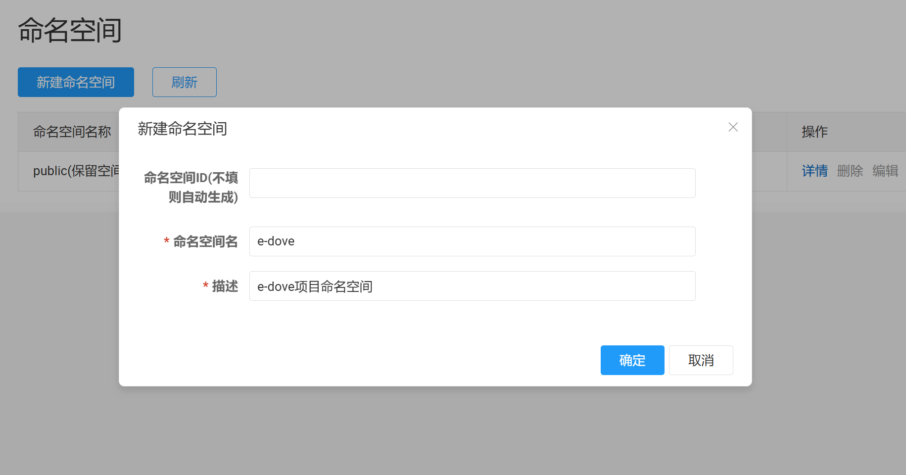
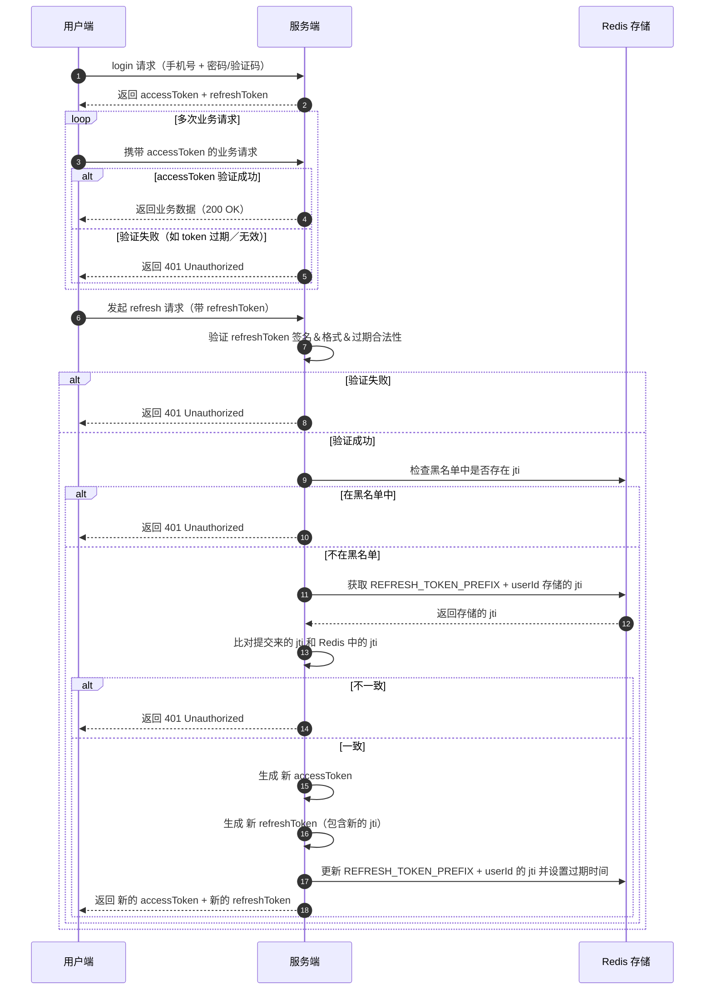

**毕设：快递驿站系统（后端部分）**


# 基本思路

选题是复刻一个菜鸟驿站，但只能用自己的手机和电脑，所以一些东西可能得换种方式实现或模拟，例如扫描枪、驿站的机器、取件码标签打印等 ；

用户的主要使用流程是：在手机小程序上可以查看快递的预计送达时间（数据可能需要Mock），送达代收点后，可以看到取件码（例如3-2-1004），到了代收点，可以手机展示个人身份码条形码，对着驿站里的机器的摄像头（由于条件限制，用前端界面+电脑摄像头模拟）放入身份码和快递上的条形码，就可以出库； 

驿站工作人员的主要使用流程是：驿站人员的可以通过小程序扫描包裹上的快递单条形码，系统生成取件码（如3-2-1004），系统打印取件码标签，驿站人员将标签贴在包裹上并将包裹放在对应的货架上，系统通知用户包裹已入库； 

附加功能（暂不实现）：寄包裹（上门取件），上门送包裹等


# 服务拆分

| 服务 / 模块                                    | 职责                                                         |
| ---------------------------------------------- | ------------------------------------------------------------ |
| **Auth 服务**（认证 /发 token /校验 token）    | 负责用户登录（校验用户名＋密码／其他方式），生成 JWT，管理 token 生效／失效逻辑，提供一个验证接口（比如给其他服务校验 token） |
| **User 服务**（用户资料 +地址管理）            | 存用户基本资料（姓名、手机号等）、地址管理、可能还有角色权限信息（比如用户是不是驿站人员） |
| **Package / 驿站业务 服务**                    | 处理包裹／取件码／包裹状态（入库、出库、扫描、标签生成／打印等）逻辑 |
| **通知服务**（可以是微服务也可以只是一个模块） | 当包裹入库完毕／生成取件码时通知用户等                       |


# 项目部署

项目中所有的组件都通过 docker compose 部署，yaml文件在项目中准备好：`./resource/docker-compose/e-dove.yaml`；


## docker环境

>  实际上windows版docker也可以；如果用linux虚拟机，则wsl和vmware都可以；

### linux环境（可选）

组件部署需要准备docker环境，这里以`wsl`为例子；

在windows下安装wsl，默认为ubuntu系统：

```
wsl --install
```

### 安装docker

>  在wsl中安装docker

方式一：

​	按照 [wsl官网](https://learn.microsoft.com/zh-cn/windows/wsl/tutorials/wsl-containers)上的说明，安装Windows 的 Docker Desktop，并集成至wsl；

方式二：

​	按照[docker官网](https://docs.docker.com/desktop/setup/install/linux/ubuntu/)上的说明，直接在wsl中安装docker；

### 配置docker镜像源（可选）

参考 [DockerHub 国内加速镜像列表](https://github.com/dongyubin/DockerHub) 配置即可；

**tip**：由于镜像源不稳定且可能被下架，可以不配置镜像源，使用代理：

1. 确保linux虚拟机的网络模式是**桥接模式**（wsl默认）
2. 开启代理，启用服务模式，还需要开启**TUN模式**；


## 启动所有组件

将`e-dove.yaml`文件放入linux的`home`目录；

启动命令：

```
docker compose -f e-dove.yaml -p e-dove up -d
```

关闭命令：

```
docker compose -f e-dove.yaml -p e-dove down
```


## 添加配置文件

### 添加redis配置

redis的配置已准备在项目中：`./resource/redis/redis.conf`；

将`redis.conf`文件放入linux的`home`目录，并将文件移动到挂载配置文件的位置；

```
sudo mv ./redis.conf ./e-dove/redis/conf/redis.conf
```


## 初始化MySQL

1. 使用 docker compose 中的 root 用户登录MySQL；
2. 执行 `./resource/mysql` 目录下的所有sql语句；


## 环境变量

项目中一些地方需要使用环境变量做配置，需要配置**项目运行的系统**的环境变量（可以是windows，也可以是打包后运行在的linux或docker）

### docker所在地址

使用：

```yaml
spring:
  data:
    redis:
      host: ${E_DOVE_DOCKER_IP_ADDR}
```

查看linux虚拟机的IP地址：

```
ip a
```

找到**eth0**的IP地址：

```
criel@CrielLaptop:~$ ip a
1: lo: ... # 省略
2: eth0: <BROADCAST,MULTICAST,UP,LOWER_UP> mtu 1500 qdisc mq state UP group default qlen 1000
    link/ether 00:15:5d:29:21:16 brd ff:ff:ff:ff:ff:ff
    inet 172.28.80.78/20 brd 172.28.95.255 scope global eth0  # IP地址为此处的172.28.80.78
       valid_lft forever preferred_lft forever
    inet6 fe80::215:5dff:fe29:2116/64 scope link
       valid_lft forever preferred_lft forever
3: ... # 省略
```

将IP地址保存在环境变量中：

```
E_DOVE_DOCKER_IP_ADDR = docker所在的主机的地址 （如果部署在本机，则可以配置成127.0.0.1）
```

### nacos命名空间

使用：

```yaml
spring:
  cloud:
    nacos:
      discovery:
        namespace: ${E_DOVE_NACOS_NAMESPACE}
```

组件启动后，在本机访问 `linux地址:8080` 进入nacos控台，首次进入需要设置**初始密码**；

在"命名空间"栏创建命名空间，建议**不设置命名空间ID**，将自动生成；



将生成后的命名空间ID保存在环境变量中：

```
E_DOVE_NACOS_NAMESPACE = Nacos自动生成的命名空间ID
```


# 业务流程

## 身份校验

jwt + refresh token

时序图：




# 数据库表设计

为每个微服务创建一个单独的数据库和对应用户；

不添加**外键约束**，由应用层维护外键的映射关系；

## User微服务

### 1. 用户表 (`user`)

**描述**：存储系统所有用户的基本信息，包括顾客和驿站工作人员。

| 字段名      | 类型     | 长度 | 主键/外键 | 允许空 | 默认值                                        | 描述                             |
| :---------- | :------- | :--- | :-------- | :----- | :-------------------------------------------- | :------------------------------- |
| user_id     | BIGINT   | -    | 主键      | 否     | （程序设定）雪花算法                          | 用户唯一标识ID                   |
| username    | VARCHAR  | 50   | 唯一索引  | 否     | （程序设定）手机号码后4位 + 随机字母          | 用户名                           |
| password    | VARCHAR  | 255  | -         | 否     | -                                             | 加密后的密码                     |
| phone       | VARCHAR  | 20   | 唯一索引  | 否     | -                                             | 手机号码                         |
| email       | VARCHAR  | 100  | 索引      | 是     | NULL                                          | 电子邮箱                         |
| avatar_url  | VARCHAR  | 255  | -         | 是     | NULL                                          | 头像图片URL地址                  |
| status      | TINYINT  | 1    | -         | 否     | 1                                             | 账户状态：0-冻结，1-正常，2-注销 |
| create_time | DATETIME | -    | -         | 否     | CURRENT_TIMESTAMP                             | 创建时间                         |
| update_time | DATETIME | -    | -         | 否     | CURRENT_TIMESTAMP ON UPDATE CURRENT_TIMESTAMP | 最后更新时间                     |

**索引**：

- 主键索引：`user_id`
- 唯一索引：`username`, `phone`,`email`


### 2. 收货地址表 (`user_address`)

**描述**：存储用户的收货地址信息，支持设置默认地址。

| 字段名         | 类型     | 长度 | 主键/外键          | 允许空 | 默认值                                        | 描述                     |
| :------------- | :------- | :--- | :----------------- | :----- | :-------------------------------------------- | :----------------------- |
| address_id     | BIGINT   | -    | 主键               | 否     | （程序设定）雪花算法                          | 地址唯一标识ID           |
| user_id        | BIGINT   | -    | 外键→user(user_id) | 否     | -                                             | 关联的用户ID             |
| receiver_name  | VARCHAR  | 50   | -                  | 否     | -                                             | 收件人姓名               |
| receiver_phone | VARCHAR  | 20   | -                  | 否     | -                                             | 收件人手机号             |
| country        | VARCHAR  | 50   | -                  | 否     | '中国'                                        | 国家                     |
| province       | VARCHAR  | 50   | -                  | 否     | -                                             | 省份                     |
| city           | VARCHAR  | 50   | -                  | 否     | -                                             | 城市                     |
| district       | VARCHAR  | 50   | -                  | 否     | -                                             | 区/县                    |
| detail_address | VARCHAR  | 255  | -                  | 否     | -                                             | 详细地址                 |
| postal_code    | VARCHAR  | 10   | -                  | 是     | NULL                                          | 邮政编码（可选）         |
| is_default     | TINYINT  | 1    | -                  | 否     | 0                                             | 是否默认地址：0-否，1-是 |
| create_time    | DATETIME | -    | -                  | 否     | CURRENT_TIMESTAMP                             | 创建时间                 |
| update_time    | DATETIME | -    | -                  | 否     | CURRENT_TIMESTAMP ON UPDATE CURRENT_TIMESTAMP | 最后更新时间             |

**索引建议**：

- 主键索引：`address_id`
- 复合索引：`(user_id, is_default)` 用于快速查询用户的默认地址


### 3. 角色表 (`role`)

**描述**：定义系统中的角色类型。

| 字段名      | 类型     | 长度 | 主键/外键 | 允许空 | 默认值                                        | 描述                             |
| :---------- | :------- | :--- | :-------- | :----- | :-------------------------------------------- | :------------------------------- |
| role_id     | BIGINT   | -    | 主键      | 否     | AUTO_INCREMENT                                | 角色唯一标识ID                   |
| role_name   | VARCHAR  | 50   | 唯一索引  | 否     | -                                             | 角色名称：普通用户、驿站管理员等 |
| role_desc   | VARCHAR  | 255  | -         | 是     | NULL                                          | 角色描述                         |
| create_time | DATETIME | -    | -         | 否     | CURRENT_TIMESTAMP                             | 创建时间                         |
| update_time | DATETIME | -    | -         | 否     | CURRENT_TIMESTAMP ON UPDATE CURRENT_TIMESTAMP | 最后更新时间                     |

**示例数据**：

- (1, 'user', '普通用户')
- (2, 'courier', '快递员')
- (3, 'station_admin', '驿站管理员')
- (4, 'super_admin', '超级管理员')


### 4. 用户角色表 (`user_role`)

**描述**：用户与角色的关联关系表，支持一个用户拥有多个角色。

| 字段名      | 类型     | 长度 | 主键/外键          | 允许空 | 默认值                                        | 描述         |
| :---------- | :------- | :--- | :----------------- | :----- | :-------------------------------------------- | :----------- |
| id          | BIGINT   | -    | 主键               | 否     | AUTO_INCREMENT                                | 主键ID       |
| user_id     | BIGINT   | -    | 外键→user(user_id) | 否     | -                                             | 用户ID       |
| role_id     | BIGINT   | -    | 外键→role(role_id) | 否     | -                                             | 角色ID       |
| create_time | DATETIME | -    | -                  | 否     | CURRENT_TIMESTAMP                             | 关联创建时间 |
| update_time | DATETIME | -    | -                  | 否     | CURRENT_TIMESTAMP ON UPDATE CURRENT_TIMESTAMP | 最后更新时间 |

**索引**：

- 主键索引：`id`
- 唯一复合索引：`(user_id, role_id)` 防止重复分配角色
- 单字段索引：`user_id`, `role_id`


### 5. 权限表 (`permission`) 

**描述**：定义系统中具体的操作权限点。

| 字段名          | 类型     | 长度 | 主键/外键 | 允许空 | 默认值                                        | 描述                                  |
| :-------------- | :------- | :--- | :-------- | :----- | :-------------------------------------------- | :------------------------------------ |
| permission_id   | BIGINT   | -    | 主键      | 否     | AUTO_INCREMENT                                | 权限唯一标识ID                        |
| permission_code | VARCHAR  | 100  | 唯一索引  | 否     | -                                             | 权限代码：如user:create, parcel:query |
| permission_name | VARCHAR  | 100  | -         | 否     | -                                             | 权限名称                              |
| permission_desc | VARCHAR  | 255  | -         | 是     | NULL                                          | 权限描述                              |
| create_time     | DATETIME | -    | -         | 否     | CURRENT_TIMESTAMP                             | 创建时间                              |
| update_time     | DATETIME | -    | -         | 否     | CURRENT_TIMESTAMP ON UPDATE CURRENT_TIMESTAMP | 最后更新时间                          |

**示例数据**：

- (1, 'user:read', '查询用户', '查看用户信息')
- (2, 'user:update', '修改用户', '修改用户资料')
- (3, 'parcel:create', '创建包裹', '录入新包裹')
- (4, 'parcel:query', '查询包裹', '查看包裹信息')


### 6. 角色权限表 (`role_permission`) 

**描述**：角色与权限的关联关系表，实现灵活的权限控制。

| 字段名        | 类型     | 长度 | 主键/外键                      | 允许空 | 默认值                                        | 描述         |
| :------------ | :------- | :--- | :----------------------------- | :----- | :-------------------------------------------- | :----------- |
| id            | BIGINT   | -    | 主键                           | 否     | AUTO_INCREMENT                                | 主键ID       |
| role_id       | BIGINT   | -    | 外键→role(role_id)             | 否     | -                                             | 角色ID       |
| permission_id | BIGINT   | -    | 外键→permission(permission_id) | 否     | -                                             | 权限ID       |
| create_time   | DATETIME | -    | -                              | 否     | CURRENT_TIMESTAMP                             | 关联创建时间 |
| update_time   | DATETIME | -    | -                              | 否     | CURRENT_TIMESTAMP ON UPDATE CURRENT_TIMESTAMP | 最后更新时间 |


