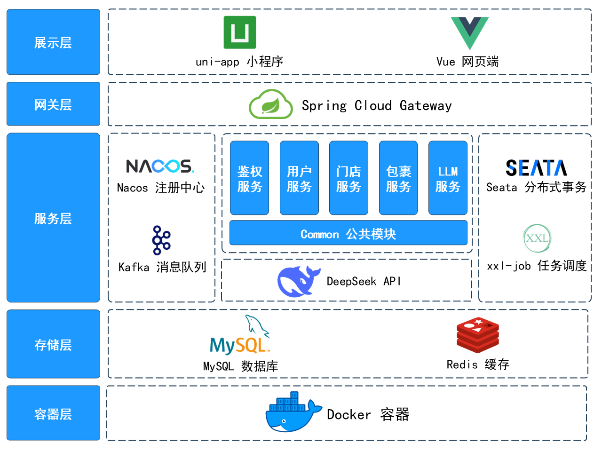

    

# 简介

> 只是个本科毕业设计，技术力有限

鸽巢驿站（E-Dove）是一个模仿**菜鸟驿站**的快递驿站系统，聚焦末端物流“最后一公里”的包裹管理服务。系统支持用户通过小程序查看快递状态、获取取件码，通过展示身份码条码在扫码设备完成取件等；支持驿站工作人员扫码录入包裹、自动生成取件码、管理货架存放等。整体流程覆盖包裹入库、存放、取件的核心业务。

项目分为3个部分：后端（此仓库） + [前端-管理端（Vue）](https://github.com/Criel14/e-dove-admin) + [小程序-用户端（uni-app）](https://github.com/Criel14/e-dove-app)

# 系统架构

# 部署

具体参考[项目部署](./resource/docs/Deployment.md)

# 其他

时间有限，有些想做的东西没机会做出来，比如 RAG、完整的 RBAC、完整的 Redis 缓存、Nginx 部署前端等
