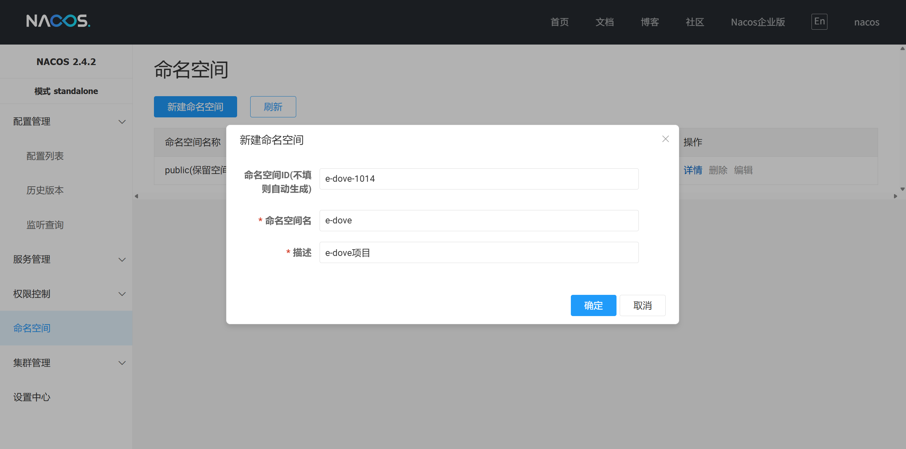
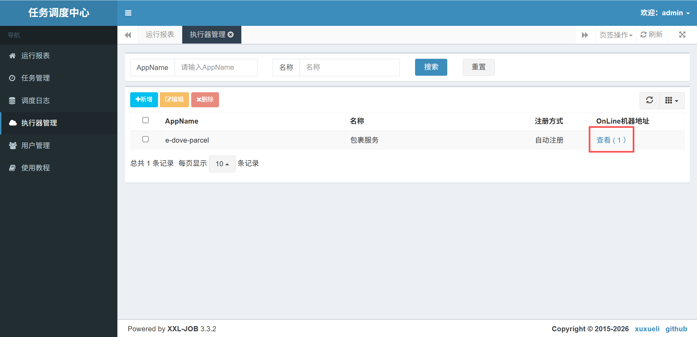
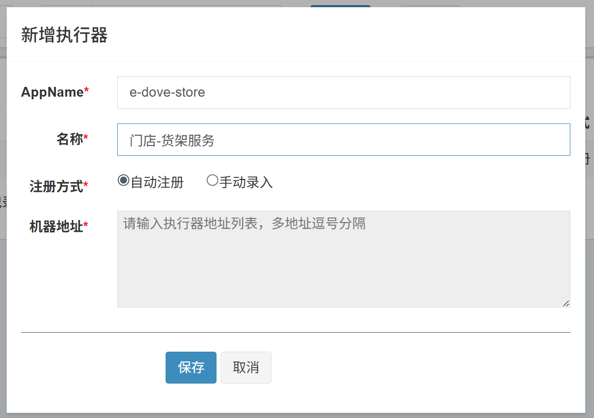
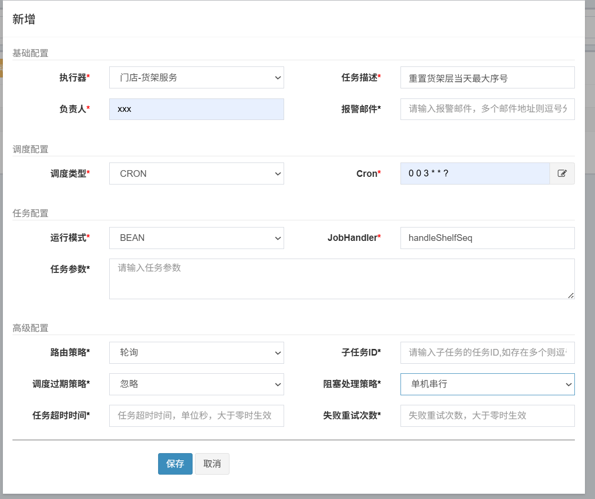

# 中间件部署

项目启动前，需要部署项目里用到的中间件，项目中所有的中间件都通过 docker compose 部署，yaml文件在项目中已准备好：[e-dove.yaml](https://github.com/Criel14/e-dove-service/blob/master/resource/docker-compose/e-dove.yaml)；需要将`e-dove.yaml`文件放入 Linux 的`home`目录；

> 任意有权限的目录都可以，后续的命令都在这个目录执行；

部署主要包括以下几个步骤：

1. **准备 Docker 环境**
2. **配置环境变量**
3. **配置中间件**（该步骤完成就即可启动 docker compose，接着再完成后面的步骤）
4. **初始化数据库**
5. **控台页面操作**


## Docker环境

>  下面的内容都以wsl为例，实际上windows版docker也可以；

### Linux环境(wsl)

在windows下安装wsl，默认为ubuntu系统：

```
wsl --install
```


### 安装Docker

>  在wsl中安装docker

方式一：按照 [wsl官网](https://learn.microsoft.com/zh-cn/windows/wsl/tutorials/wsl-containers) 上的说明，安装Windows 的 Docker Desktop，并集成至wsl；

方式二：按照 [docker官网](https://docs.docker.com/desktop/setup/install/linux/ubuntu/) 上的说明，直接在wsl中安装docker；


### 配置Docker镜像源（可选）

参考 [DockerHub 国内加速镜像列表](https://github.com/dongyubin/DockerHub) 配置即可；

**tip**：由于镜像源不稳定且可能被下架，可以不配置镜像源，使用**代理**：

1. 确保linux虚拟机的网络模式是**桥接模式**（wsl默认）
2. 开启代理，启用**服务模式**，还需要开启**TUN模式**；


## 环境变量

项目中一些地方需要使用环境变量做配置，需要配置**项目运行的系统**的环境变量（可以是windows，也可以是打包后运行在的linux或docker）

> 在配置里引用环境变量，部署就不用改那么多地方；
>
> 但是有些地方还是必须要修改，比如seata的配置等，没有办法；


### Docker运行地址

项目中的使用示例：

```yaml
spring:
  data:
    redis:
      host: ${E_DOVE_DOCKER_IP_ADDR}
```

查看linux虚拟机的IP地址：

```
ip a
```

找到**eth0**的IP地址：

```
criel@CrielLaptop:~$ ip a
1: lo: ... # 省略
2: eth0: <BROADCAST,MULTICAST,UP,LOWER_UP> mtu 1500 qdisc mq state UP group default qlen 1000
    link/ether 00:15:5d:29:21:16 brd ff:ff:ff:ff:ff:ff
    inet 172.28.80.78/20 brd 172.28.95.255 scope global eth0  # <---- IP地址为此处的172.28.80.78
       valid_lft forever preferred_lft forever
    inet6 fe80::215:5dff:fe29:2116/64 scope link
       valid_lft forever preferred_lft forever
3: ... # 省略
```

将IP地址保存在环境变量中：

```
E_DOVE_DOCKER_IP_ADDR=你的docker所在的主机的地址 （如果部署在本机，则可以配置成127.0.0.1）
```


### 大模型的 API key

项目中用到了大模型，选择的是DeepSeek，前往 [deepseek开放平台](https://platform.deepseek.com/api_keys) 获取你的 API key；

项目中的使用示例：

```yaml
# 大模型配置，这里用deepseek
langchain4j:
  open-ai:
    chat-model:
      api-key: ${DEEPSEEK_API_KEY}
      base-url: https://api.deepseek.com
      model-name: deepseek-chat
      log-requests: true
      log-responses: true
```

将 API key 保存在环境变量中：

```
DEEPSEEK_API_KEY=你的API key
```

> 如果想用别的模型，则上面的配置信息也需要相应的修改


## 配置中间件

配置完成后的目录结构如下：

```
home
├── e-dove.yaml
└── e-dove
    ├── mysql
    │   └── conf
    │       └── ...（mysql配置文件，仅保留目录，项目里暂无配置）
    ├── redis
    │   ├── conf
    │       └── redis.conf（redis配置文件）
    │   └── logs（redis日志，docker挂载后生成在此处）
    ├── nacos-standalone-logs
    │   └── ...（nacos日志文件，docker挂载后生成在此处）
    ├── seata
    │   ├── conf
    │   │   └── application.yml（seata配置文件）
    │   └── jdbc
    │       └──mysql-connector-j-8.4.0.jar（jdbc依赖）
    └── xxl-job
    	├── conf
        │   └── application.properties（xxl-job-admin配置文件）
        └── logs（xxl-job-admin日志，docker挂载后生成在此处）
```


### 配置 Redis

redis 的**配置**已准备在项目中：[redis.conf](https://github.com/Criel14/e-dove-service/blob/master/resource/redis/redis.conf)

将文件放入linux的`home`目录，并将文件移动到挂载配置文件的位置；

```
sudo mv ./redis.conf ./e-dove/redis/conf/redis.conf
```


### 配置 XXL-JOB

xxl-job 的**配置**已准备在项目中：[application.properties](https://github.com/Criel14/e-dove-service/blob/master/resource/xxl-job/application.properties)

将文件放入linux的`home`目录，并将文件移动到挂载配置文件的位置；

```
sudo mv ./application.properties ./e-dove/xxl-job/conf/application.properties
```


### 配置 Seata

seata 的**配置**已准备在项目中：[application.yml](https://github.com/Criel14/e-dove-service/blob/master/resource/seata/application.yml)

添加前，需要修改 [e-dove.yaml](https://github.com/Criel14/e-dove-service/blob/master/resource/docker-compose/e-dove.yaml#L73) 中的内容：

```yml
services:
  seata-server:
	...
    environment:
      - SEATA_IP=172.28.80.78  # 改成linux的ip地址，可用`ip a`命令查看
    ...
```

将`application.yml`放入linux的`home`目录，并将文件移动到挂载配置文件的位置；

```
sudo mv application.yml ./e-dove/seata/conf/
```

除此之外，seata镜像本身不包含**jdbc**，需要自己准备，已准备在项目中：`./resource/seata/mysql-connector-j-8.4.0.jar`

将文件放入linux的`home`目录，并将文件移动到挂载配置文件的位置；

```
sudo mv mysql-connector-j-8.4.0.jar ./e-dove/seata/jdbc/
```


## 启动组件

>  上述步骤完成就即可启动 docker compose，接着再完成后面的步骤

启动命令：

```
docker compose -f e-dove.yaml -p e-dove up -d
```

关闭命令：

```
docker compose -f e-dove.yaml -p e-dove down
```

> 第一次启动需要安装镜像，需要等待一段时间


## 初始化数据库

docker compose 启动完成后：

1. 使用 [e-dove.yaml](https://github.com/Criel14/e-dove-service/blob/master/resource/docker-compose/e-dove.yaml#L42) 中的 `root` 用户登录MySQL；

```yaml
services:
  mysql:
    environment:
      - MYSQL_ROOT_PASSWORD=eDoveMysql1014 # 管理员密码
    ...
```

2. 执行 [./resource/mysql](https://github.com/Criel14/e-dove-service/tree/master/resource/mysql) 目录下的所有sql语句；


## 控台页面操作

### 创建 Nacos 命名空间

组件启动后，在本机访问 `linux地址:8848/nacos` 进入nacos控台，首次进入需要设置**初始密码**，设置为：用户名`nacos`，密码`nacos`；

在"**命名空间**"栏创建命名空间，命名空间ID设置为`e-dove-1014`，与[配置](https://github.com/Criel14/e-dove-service/blob/master/e-dove-auth/src/main/resources/bootstrap.yaml#L10)中一致，如下图所示：




### 配置 XXL-JOB 调度中心

组件启动后，在本机访问 `linux地址:8080/xxl-job-admin` 进入xxl-job调度中心，使用默认登录账号登录：用户名`admin`，密码`123456`；

以 Parcel 服务为例：在 Parcel 服务的[配置文件](https://github.com/Criel14/e-dove-service/blob/master/e-dove-parcel/src/main/resources/application.yaml#L37)中，我们做了如下配置：

```yaml
# xxl-job 配置
xxl:
  job:
    executor:
      appname: e-dove-parcel # 执行器AppName（执行器心跳注册表AppName，为空则关闭自动注册）
      ...
```

并定义了任务方法：

```java
@XxlJob("handleStalePackages")
public void handleStalePackages() {
    ...
}
```

需要将它们配置在调度中心里，其他服务的定时任务同理；

#### 新增执行器

> ”执行器“是我们用来执行任务的服务，即`@XxlJob`声明的方法所在的服务；

在“**执行器管理**”页新增执行器，AppName和上面的配置相同，其他的参考下图：


新增后，我们可以只运行 **Parcel 服务**来测试（在IDEA里运行就可以），刷新xxl-job调度中心，直到出现下图的情况则说明成功：



同样地，还需要新增其他用到了xxl-job的服务：

**Store 服务**：




#### 新增任务

在“**任务管理**”页新增任务，参考下面的配置，主要是 **JobHandler** 需要和`@XxlJob`注解的参数一致（邮箱是不用填的）

> 这里的Cron表达式 `0 0 3 * * ?` 表示**每天凌晨3点**执行


完成后，选中任务并点击**启动**即可；

同样地，还需要新增其他任务：

**Store 服务**：


